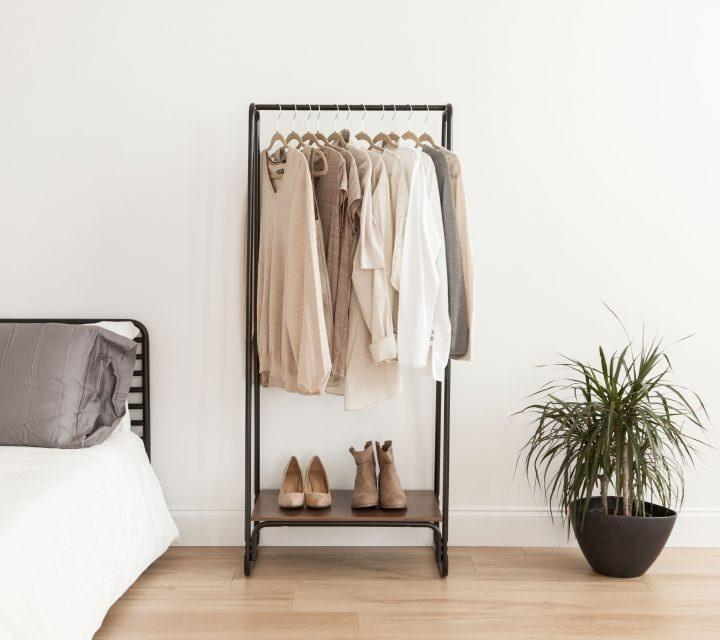

# FG-CLIP2适配爱芯AX650
下载fg-clip2-base模型
```bash
export HF_ENDPOINT=https://hf-mirror.com

huggingface-cli download  qihoo360/fg-clip2-base --local-dir ./qihoo360/fg-clip2-base
```
## 导出模型（PyTorch -> ONNX）
执行脚本：
```bash
cd ax_tools

python export_onnx.py 
```
会在当前目录下生成`image_encoder.onnx`和`text_encoder.onnx`两个模型，优化模型结构
- 用onnxsim来优化`image_encoder.onnx`（PS：勿用onnxslim优化，会在模型推理时出现错误）
- 用onnxslim来优化`text_encoder.onnx`

## 验证onnx模型的正确性
执行脚本：
```bash
python run_onnx.py
```
同时会在当前目录下生成后续编译模型过程中，所需要的量化校准数据集，目录如下：
```bash
calib_data/
├── image
│   ├── calib_data_image.tar
│   └── image_input.npy
└── text
    ├── calib_data_text.tar
    ├── input_ids_0.npy
    ├── input_ids_1.npy
    ├── input_ids_2.npy
    └── input_ids_3.npy
```
其中`calib_data_image.tar`和`calib_data_text.tar`为量化校准数据集。


## 模型转换（ONNX -> AXModel）
已提供必要的量化配置
- config_image.json，将`calibration_dataset`字段指向`calib_data_image.tar`
- config_text.json，将`calibration_dataset`字段指向`calib_data_text.tar`

执行编译命令：
```bash
# image_encoder.onnx
pulsar2 build --input image_encoder.onnx --config config_image.json --output_dir output_image_encoder --output_name image_encoder.axmodel

# text_encoder.onnx
pulsar2 build --input text_encoder.onnx --config config_text.json --output_dir output_text_encoder/ --output_name text_encoder.axmodel
```

## 板端模型推理
将编译好的模型scp到板端，以及必要的文件数据
```bash
scp output_image_encoder/image_encoder.axmodel root@10.126.29.35:/root/wangjian/fg-clip2

scp output_text_encoder/text_encoder.axmodel  root@10.126.29.35:/root/wangjian/fg-clip2

scp run_axmodel.py bedroom.jpg root@10.126.29.35:/root/wangjian/fg-clip2

# hf中的相关配置文件
scp /data/wangjian/project/hf_cache/qihoo360/fg-clip2-base/*.{py,json} root@10.126.29.35:/root/wangjian/hf_cache/fg-clip2-base
```

执行推理脚本：
```bash
python run_axmodel.py
```

图片输入：\


文本输入：

```bash
["一个简约风格的卧室角落，黑色金属衣架上挂着多件米色和白色的衣物，下方架子放着两双浅色鞋子，旁边是一盆绿植，左侧可见一张铺有白色床单和灰色枕头的床。",
"一个简约风格的卧室角落，黑色金属衣架上挂着多件红色和蓝色的衣物，下方架子放着两双黑色高跟鞋，旁边是一盆绿植，左侧可见一张铺有白色床单和灰色枕头的床。",
"一个简约风格的卧室角落，黑色金属衣架上挂着多件米色和白色的衣物，下方架子放着两双运动鞋，旁边是一盆仙人掌，左侧可见一张铺有白色床单和灰色枕头的床。",
"一个繁忙的街头市场，摊位上摆满水果，背景是高楼大厦，人们在喧闹中购物。"]
```

推理结果如下：
```bash
Logits per image: tensor([[9.8757e-01, 4.7755e-03, 7.6510e-03, 1.3484e-14]], dtype=torch.float64)
```

